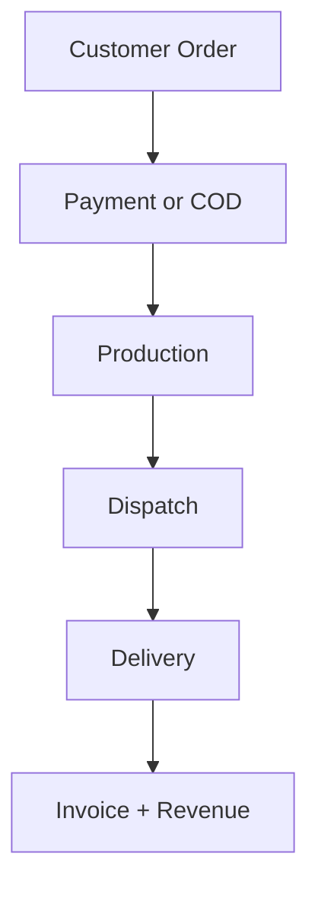

# 🍞 Bake-Ree

**Bakery operations platform** — customer ordering + backoffice ERP + CRM + delivery + loyalty.

This README defines the **target skeleton** and **industry-level information architecture** for the system. It removes the old admin-only view and replaces it with a unified **Operations Console** (ERP + CRM + Ops).

---

## 📌 Vision & Status

- **Customer apps**: ordering, tracking, account, loyalty (existing + ongoing).
- **Operations Console**: replaces `/admin` with `/ops` and adds ERP + CRM in a single sidebar-driven workspace.
- **This document is the blueprint** for the full buildout (not all items are implemented yet).

---

## 📋 Table of Contents

- [Tech Stack](#-tech-stack)
- [Quick Start](#-quick-start)
- [Product Scope](#-product-scope)
- [Navigation Map (Sidebar + Sub-sidebar)](#-navigation-map-sidebar--sub-sidebar)
- [Core Process Flows (Diagrams)](#-core-process-flows-diagrams)
- [ERP Modules](#-erp-modules)
- [ERP Step-by-Step (Detailed)](#-erp-step-by-step-detailed)
- [CRM Modules](#-crm-modules)
- [CRM Step-by-Step (Detailed)](#-crm-step-by-step-detailed)
- [Analytics & KPIs](#-analytics--kpis)
- [Data Entities (High-Level)](#-data-entities-high-level)
- [Target Project Structure](#-target-project-structure)
- [Target API Overview](#-target-api-overview)
- [Implementation Plan](#-implementation-plan)

---

## 🛠 Tech Stack

| Layer | Technologies |
|-------|--------------|
| **Frontend** | Next.js (App Router), TypeScript, Tailwind CSS, Zustand, Framer Motion, React Hot Toast, Socket.io Client, Chart.js / Recharts |
| **Backend** | Express.js, MongoDB, Mongoose, JWT, bcryptjs, Nodemailer, Socket.io |
| **Auth** | JWT tokens, protected routes, role-based access (Owner, Manager, Finance, HR, Ops, Kitchen, Delivery, Support, Customer) |

---

## 🚀 Quick Start

```bash
# Backend
cd server && npm install && npm run dev   # http://localhost:5000

# Frontend
cd client && npm install && npm run dev   # http://localhost:3000
```

---

## ✅ Product Scope

### Customer Experience
- Product catalog, cart, checkout, tracking, order history
- Multiple addresses, wishlists, loyalty, notifications
- Self-service profile and preferences

### Operations Console (replaces `/admin`)
- **ERP**: inventory, procurement, production, costing, finance, payroll, staff, vendors
- **CRM**: customer 360, segments, campaigns, loyalty, churn/retention, tiering
- **Ops**: orders, fulfillment, delivery, kitchen, routes, zones, SLA tracking

---

## 🧭 Navigation Map (Sidebar + Sub-sidebar)

### Top-Level Sidebar (Operations Console `/ops`)

- **Home**
- **Orders**
- **Production**
- **Inventory**
- **Procurement**
- **Logistics**
- **Customers (CRM)**
- **Loyalty & Rewards**
- **Finance**
- **HR & Payroll**
- **Analytics**
- **Settings**

### Sub-sidebar: ERP

- **Production**
  - Batches & Recipes
  - Work Orders
  - Yield & Wastage
  - Quality Checks
- **Inventory**
  - Stock Levels
  - Stock Adjustments
  - Transfers
  - Expiry / Batch Tracking
- **Procurement**
  - Vendors
  - Purchase Requests
  - Purchase Orders
  - Goods Received Note (GRN)
  - Vendor Bills
- **Logistics**
  - Delivery Queue
  - Route Plans
  - Fleet / Drivers
  - Zones & Charges
- **Finance**
  - Invoices
  - Payments
  - Taxes
  - P&L
  - Costing & Margin
- **HR & Payroll**
  - Employees
  - Attendance
  - Shifts
  - Payroll Runs
  - Payslips

### Sub-sidebar: CRM

- **Customer 360**
  - Profile & Contact
  - Order History
  - Spend & Frequency
  - Loyalty Ledger
- **Segments**
  - Tier Distribution
  - Lifecycle (New, Active, At-Risk, Churned)
  - RFM (Recency/Frequency/Monetary)
- **Engagement**
  - Campaigns
  - Offers / Coupons
  - Automation Rules
- **Insights**
  - CLV
  - Churn Risk
  - Product Affinity
  - Redemption Analysis

---

## 🔁 Core Process Flows (Diagrams)

### 1) Order-to-Cash

```text
Customer Order
   ↓
Payment / COD
   ↓
Order Verification
   ↓
Production (Kitchen)
   ↓
Packing & Dispatch
   ↓
Delivery
   ↓
Invoice + Revenue Posting
```

### 2) Procure-to-Pay

```text
Purchase Request
   ↓
PO Approval
   ↓
Vendor Fulfillment
   ↓
GRN (Inventory In)
   ↓
Vendor Bill
   ↓
Payment
```

### 3) Make-to-Deliver

```text
Sales Forecast
   ↓
Batch Plan
   ↓
Production Run
   ↓
Quality Check
   ↓
Finished Goods Stock
   ↓
Order Fulfillment
```

### 4) CRM Lifecycle

```text
Acquire → Onboard → Retain → Upsell → Reactivate
```

### Mermaid (optional)



---

## 🧩 ERP Modules

- **Production**: recipes, batch planning, work orders, yield, wastage, QC
- **Inventory**: stock ledger, batch/expiry, movements, shrinkage, transfers
- **Procurement**: vendors, RFQ/PO, approvals, GRN, bill matching
- **Logistics**: dispatch, routes, driver assignment, SLA tracking
- **Finance**: invoices, payments, tax, cost accounting, margin, P&L
- **HR & Payroll**: employees, shifts, attendance, payroll runs, payslips

---

## 🧱 ERP Step-by-Step (Detailed)

This is the **first build layer**. Each module below includes pages, core tables, workflows, and acceptance goals.

### 1) Production

**Core Pages**
- Batches & Recipes
- Work Orders
- Yield & Wastage
- Quality Checks
- Production Calendar

**Primary Data Tables**
- `recipes`, `ingredients`, `batches`, `work_orders`, `qc_checks`, `waste_logs`

**Workflow (Make-to-Deliver)**
1. Create or update **Recipe** with ingredients and target yield.
2. Plan **Batch** for a date/shift with required quantities.
3. Generate **Work Orders** from the batch plan.
4. Kitchen marks **In-Progress → Complete** on work orders.
5. Record **Yield vs Planned** and log **Wastage**.
6. Run **Quality Checks** before moving to finished stock.
7. Post finished goods into **Inventory**.

**Acceptance Goals**
- Batch planning creates work orders automatically.
- Yield and waste are traceable per batch.
- Production completion updates finished stock.

---

### 2) Inventory

**Core Pages**
- Stock Levels (by item, batch, expiry)
- Stock Movements (ledger)
- Adjustments & Audits
- Transfers (location/warehouse)

**Primary Data Tables**
- `inventory_items`, `stock_batches`, `stock_movements`, `stock_adjustments`, `warehouses`

**Workflow (Stock Management)**
1. Stock in via **GRN** or **Production Output**.
2. Stock out via **Order Fulfillment**.
3. Adjustment via audit (damage, expiry, shrinkage).
4. Transfers between locations.
5. Alert on low stock / expiring batches.

**Acceptance Goals**
- Every stock change creates a ledger entry.
- Batch/expiry tracking visible at item level.
- Accurate “available stock” for order allocation.

---

### 3) Procurement

**Core Pages**
- Vendors
- Purchase Requests
- Purchase Orders
- Goods Received (GRN)
- Vendor Bills & Payments

**Primary Data Tables**
- `vendors`, `purchase_requests`, `purchase_orders`, `grns`, `vendor_bills`

**Workflow (Procure-to-Pay)**
1. Create **Purchase Request** for low stock.
2. Manager approves → generate **Purchase Order**.
3. Vendor delivers → create **GRN**.
4. System matches GRN to PO.
5. Vendor submits **Bill** → finance approves.
6. **Payment** issued and recorded.

**Acceptance Goals**
- GRN increases inventory and closes PO lines.
- Bills cannot be paid without matched GRN.
- Full PO status tracking (Open/Partial/Closed).

---

### 4) Logistics

**Core Pages**
- Delivery Queue
- Route Plans
- Fleet / Drivers
- Zones & Charges
- SLA / On-Time Dashboard

**Primary Data Tables**
- `deliveries`, `routes`, `drivers`, `zones`, `delivery_events`

**Workflow (Dispatch-to-Delivery)**
1. Order becomes **Ready** → added to delivery queue.
2. Assign **Driver** and **Route**.
3. Track status: Assigned → Picked Up → In Transit → Delivered.
4. Record **ETA** and on-time performance.
5. Post delivery completion to order + CRM.

**Acceptance Goals**
- Delivery status updates are real-time.
- Zones auto-apply delivery charges and SLAs.
- Dispatch dashboard shows overdue/late deliveries.

---

### 5) Finance

**Core Pages**
- Invoices
- Payments & Refunds
- Taxes
- Costing & Margin
- P&L Summary

**Primary Data Tables**
- `invoices`, `payments`, `refunds`, `tax_rules`, `cost_ledger`

**Workflow (Order-to-Cash)**
1. Order paid → auto-generate **Invoice**.
2. Capture payment or mark COD.
3. Post **Refunds** when needed.
4. Compute **Tax** and **Margin**.
5. Consolidate into **P&L**.

**Acceptance Goals**
- Invoice status always matches payment status.
- Tax calculations are auditable by line item.
- Margin available per product and per order.

---

### 6) HR & Payroll

**Core Pages**
- Employees
- Attendance
- Shifts
- Payroll Runs
- Payslips

**Primary Data Tables**
- `employees`, `attendance`, `shifts`, `payroll_runs`, `payslips`

**Workflow (Hire-to-Pay)**
1. Add **Employee** with role, pay type, bank info.
2. Track **Attendance** daily (manual or biometric).
3. Assign **Shifts** and overtime rules.
4. Run **Payroll** for a period.
5. Generate **Payslips** and export.

**Acceptance Goals**
- Payroll uses attendance + shift rules.
- Payslips stored per period and employee.
- Role-based access for HR/Finance only.

---

### ERP Build Order (Step-by-Step)

1. Inventory (stock ledger, batch/expiry, adjustments)
2. Procurement (vendors → PO → GRN)
3. Production (recipes → batches → work orders)
4. Logistics (delivery queue → routes → SLAs)
5. Finance (invoices → payments → P&L)
6. HR & Payroll (employees → attendance → payroll)

---

## 🤝 CRM Modules

- **Customer 360**: full profile, all orders, channels, preferences
- **Segmentation**: tier distribution, RFM, lifecycle stage
- **Loyalty**: earn/redeem, balance, expiry, rules engine
- **Campaigns**: offers, coupons, A/B, automation rules
- **Insights**: CLV, churn risk, product affinity, cohort analysis

---

## 🧱 CRM Step-by-Step (Detailed)

This is the **second build layer**. It extends customer intelligence, loyalty, and engagement.

### 1) Customer 360

**Core Pages**
- Customer List (filters, tags, lifecycle stage)
- Customer Profile
- Order History
- Loyalty Ledger
- Communication Preferences

**Primary Data Tables**
- `customers`, `customer_tags`, `customer_notes`, `customer_events`, `loyalty_ledger`

**Workflow**
1. Create/merge customer profiles from orders, signup, or import.
2. View complete timeline: orders, refunds, loyalty, support notes.
3. Add internal notes, tags, and next-action reminders.
4. Sync preferences (email/SMS/push).

**Acceptance Goals**
- 360 view loads in <2s for active customers.
- Timeline aggregates orders + loyalty + service events.
- Tags and notes are searchable and filterable.

---

### 2) Segmentation

**Core Pages**
- Tier Distribution
- RFM Segments
- Lifecycle Segments (New, Active, At-Risk, Churned)
- Saved Segments

**Primary Data Tables**
- `segments`, `segment_rules`, `rfm_scores`, `lifecycle_states`

**Workflow**
1. Calculate RFM scores nightly.
2. Assign lifecycle stage based on last order date.
3. Build segments by filters (tier, AOV, recency, city).
4. Save segments for campaigns.

**Acceptance Goals**
- Segment counts update daily.
- Saved segments are reusable in campaigns.
- Tier distribution is available across time ranges.

---

### 3) Loyalty & Rewards

**Core Pages**
- Loyalty Dashboard
- Rules Engine (earn/redeem rules)
- Points Expiry
- Redemption Requests

**Primary Data Tables**
- `loyalty_rules`, `loyalty_ledger`, `loyalty_expiry`, `redemptions`

**Workflow**
1. Define earn rules (order value, tier multipliers).
2. Auto-credit points on completed orders.
3. Allow redemption at checkout and in ops.
4. Handle expiry and bonus campaigns.

**Acceptance Goals**
- Points balance always reconciles with ledger.
- Redemption is blocked when insufficient balance.
- Expiry notifications are generated automatically.

---

### 4) Campaigns & Automation

**Core Pages**
- Campaign Builder
- Offer/Coupon Manager
- Automation Rules
- Campaign Performance

**Primary Data Tables**
- `campaigns`, `campaign_rules`, `offers`, `coupons`, `messages`

**Workflow**
1. Select segment → create campaign.
2. Attach offers/coupons and channel (email/SMS/push).
3. Schedule or trigger by rule (e.g., 14 days inactive).
4. Track opens, redemptions, revenue lift.

**Acceptance Goals**
- Campaigns can target saved segments.
- A/B testing available for offers or copy.
- Performance tracked by segment + channel.

---

### 5) Insights

**Core Pages**
- CLV & Cohorts
- Churn Risk Dashboard
- Product Affinity
- Redemption Analysis

**Primary Data Tables**
- `clv_snapshots`, `cohorts`, `churn_scores`, `product_affinity`

**Workflow**
1. Calculate CLV monthly.
2. Build cohorts by month of first order.
3. Score churn risk based on recency and frequency.
4. Identify products that co-occur in orders.

**Acceptance Goals**
- CLV visible at customer + segment level.
- Churn risk flagged on customer list.
- Affinity insights feed cross-sell suggestions.

---

### CRM Build Order (Step-by-Step)

1. Customer 360 (timeline + tags + notes)
2. Segmentation (tier + RFM + lifecycle)
3. Loyalty & Rewards (rules + ledger + expiry)
4. Campaigns (offers + automation)
5. Insights (CLV + churn + affinity)

---

## 📊 Analytics & KPIs

- **Sales**: revenue, AOV, repeat rate, refunds
- **Ops**: on-time delivery, production yield, waste %, SLA compliance
- **Inventory**: stock turns, aging, out-of-stock
- **Finance**: gross margin, COGS, tax exposure, cashflow
- **CRM**: CLV, churn, tier distribution, redemption rate

---

## 🧱 Data Entities (High-Level)

- Users, Roles, Permissions
- Customers, LoyaltyLedger, Segments
- Orders, OrderItems, Payments, Refunds
- Products, Recipes, Batches
- InventoryItems, StockMovements, Warehouses
- Vendors, PurchaseOrders, GRNs, VendorBills
- Deliveries, Routes, Drivers, Zones
- Employees, Attendance, PayrollRuns, Payslips
- Invoices, Taxes, GLAccounts

---

## 📁 Target Project Structure

```
Bake-Ree/
├── client/
│   ├── src/
│   │   ├── app/
│   │   │   ├── (customer)/
│   │   │   ├── (ops)/
│   │   │   │   ├── ops/
│   │   │   │   │   ├── orders/
│   │   │   │   │   ├── production/
│   │   │   │   │   ├── inventory/
│   │   │   │   │   ├── procurement/
│   │   │   │   │   ├── logistics/
│   │   │   │   │   ├── crm/
│   │   │   │   │   ├── loyalty/
│   │   │   │   │   ├── finance/
│   │   │   │   │   ├── hr/
│   │   │   │   │   └── analytics/
│   │   ├── components/
│   │   ├── hooks/
│   │   ├── services/
│   │   ├── store/
│   │   └── utils/
├── server/
│   ├── controllers/
│   ├── models/
│   ├── routes/
│   ├── services/
│   └── server.js
└── README.md
```

---

## 📡 Target API Overview

| Area | Base Path | Key Features |
|------|-----------|--------------|
| Auth | `/api/auth` | Login, roles, permissions |
| Orders | `/api/orders` | Create, list, status, fulfillment |
| Production | `/api/production` | Batches, recipes, work orders |
| Inventory | `/api/inventory` | Stock, transfers, adjustments |
| Procurement | `/api/procurement` | Vendors, PO, GRN, bills |
| Logistics | `/api/logistics` | Routes, drivers, zones |
| CRM | `/api/crm` | Customer 360, segments, insights |
| Loyalty | `/api/loyalty` | Earn, redeem, ledger |
| Finance | `/api/finance` | Invoices, payments, taxes |
| HR | `/api/hr` | Employees, attendance, payroll |
| Analytics | `/api/analytics` | KPIs, reports |

---

## 🧭 Implementation Plan

### Phase 1 — Skeleton & Navigation
1. Remove `/admin` routes and tabs; replace with `/ops` layout and sidebar.
2. Create section shells for each top-level module.
3. Implement sub-sidebar for ERP + CRM.

### Phase 2 — ERP Core
1. **Inventory**: stock list, adjustments, transfers, batch/expiry.
2. **Procurement**: vendors → PO → GRN → bill.
3. **Production**: recipes → batch plan → work orders → QC.
4. **Logistics**: routes, driver assignment, SLA tracking.
5. **Finance**: invoices, payments, tax ledger, margins.
6. **HR & Payroll**: employees, attendance, payroll runs.

### Phase 3 — CRM Core
1. **Customer 360**: profile + all orders + loyalty ledger.
2. **Segmentation**: tier distribution, RFM, lifecycle.
3. **Insights**: CLV, churn risk, top products.
4. **Engagement**: offers, coupons, automation rules.

### Phase 4 — Analytics & Automation
1. Cross-module dashboards and KPI views.
2. Scheduled reports and exports.
3. Rule engine for loyalty + CRM triggers.

---

**Last updated:** January 2026 · **Bake-Ree** — *Bakery operations, reimagined.*
