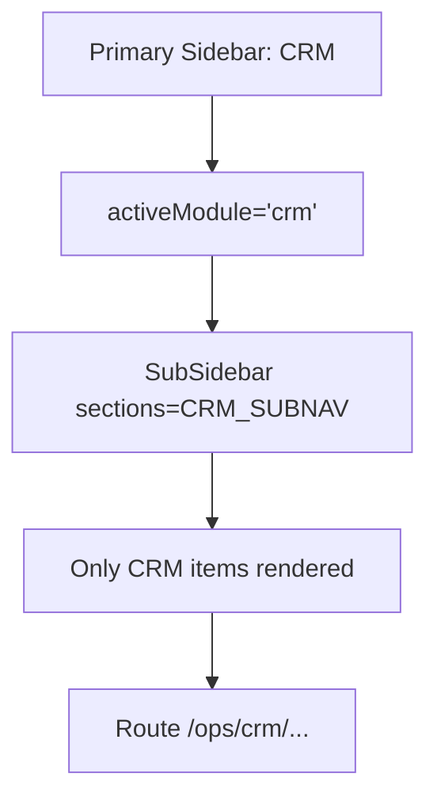
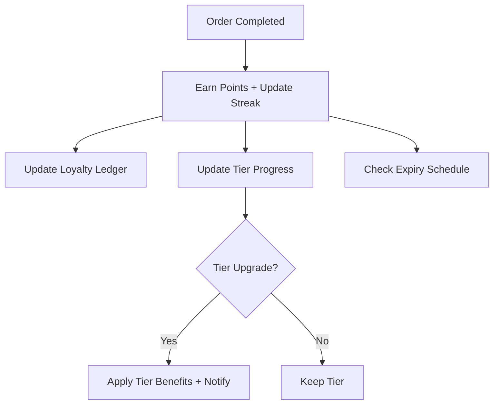

# CRM Architecture

## CRM Navigation Render



## Customer 360 Data Flow

```mermaid
flowchart TD
  A[Customer ID] --> B[Fetch Customer]
  B --> C[Fetch Orders Summary]
  B --> D[Fetch Loyalty Ledger + Tier]
  B --> E[Fetch Wallet/Outstanding]
  B --> F[Fetch Wishlist]
  C --> G[Compute RFM/Lifecycle]
  G --> H[Compute CLV/Churn Score]
  H --> I[Recommendations (rules now, AI later)]
  I --> J[Persist CustomerInsight]
```

## Loyalty Tier + Streak


