# Inventory + Procurement Architecture

This document captures the inventory/procurement scope, routing, and system flows for the Ops ERP modules.

## Module Scoping (Sub-sidebar)
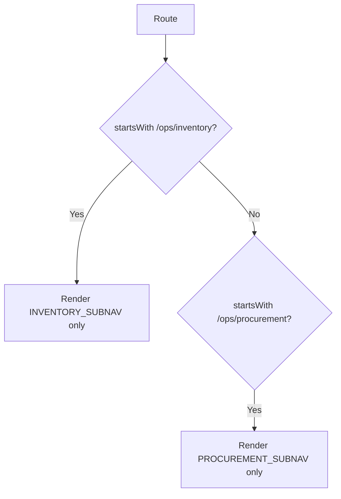

## Procure-to-Stock (3-way match)
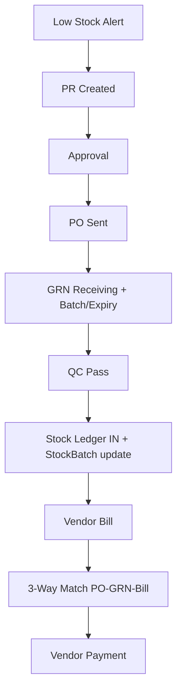

## FEFO Reservation -> Consumption
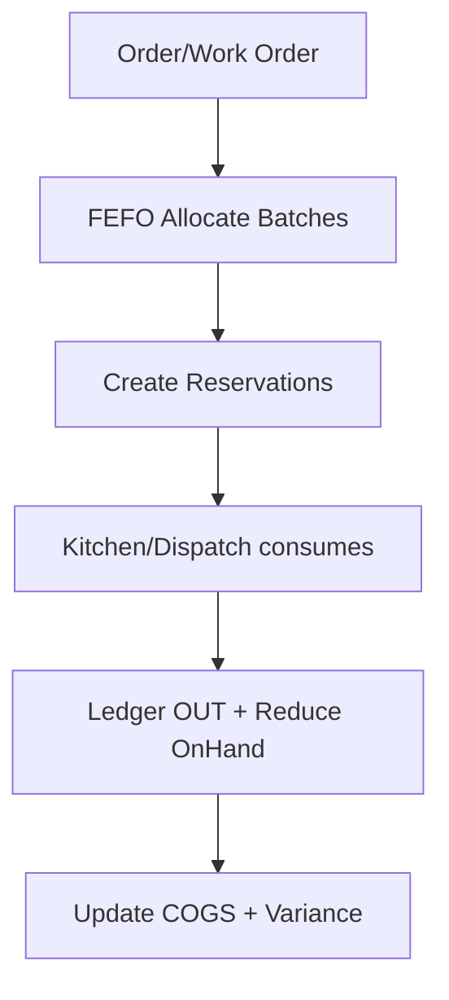

## ERP Service Topology
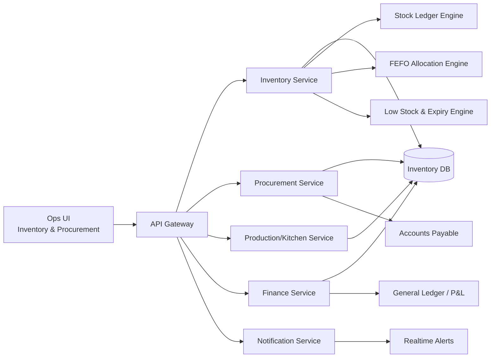

## Stock + Ledger Flow
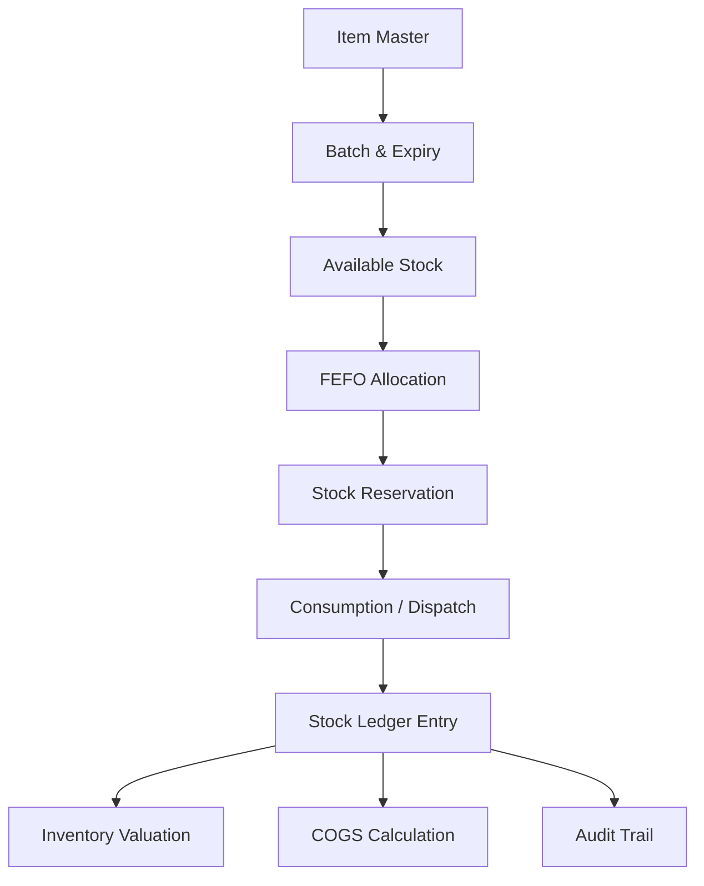

## Low Stock to Payment
```mermaid
flowchart TD
  LowStock[Low Stock Trigger] --> PR[Purchase Request]
  PR --> Approval[Manager Approval]
  Approval --> PO[Purchase Order]

  PO --> Vendor[Vendor Delivery]
  Vendor --> GRN[GRN + Batch + Expiry]

  GRN --> QC[Quality Check]
  QC -->|Pass| StockIN[Ledger IN]
  QC -->|Fail| Hold[Quality Hold / Return]

  StockIN --> Bill[Vendor Bill]
  Bill --> Match[3-Way Match<br/>(PO-GRN-Bill)]
  Match --> Payment[Vendor Payment]
```

## FEFO Allocation Detail
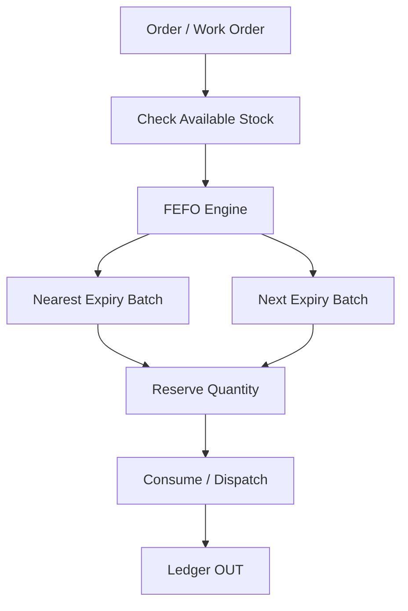

## Production Consumption & Output
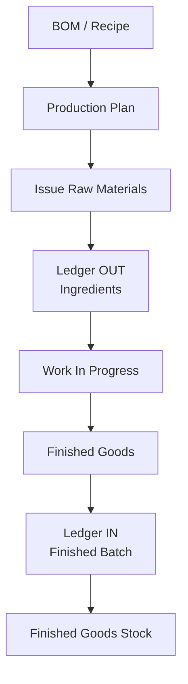

## Expiry Action Paths
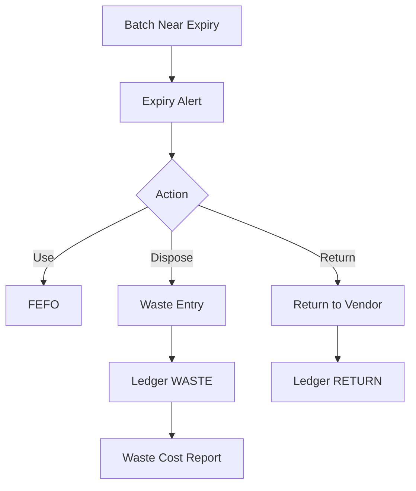

## Transfers
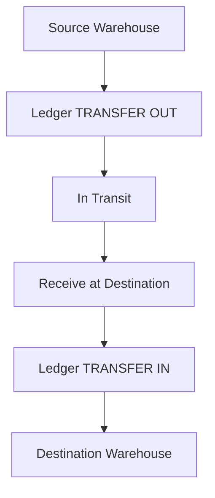

## Reorder Automation
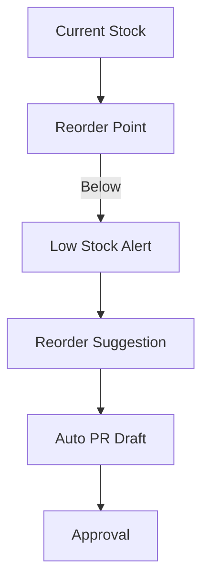

## Finance Posting Hooks
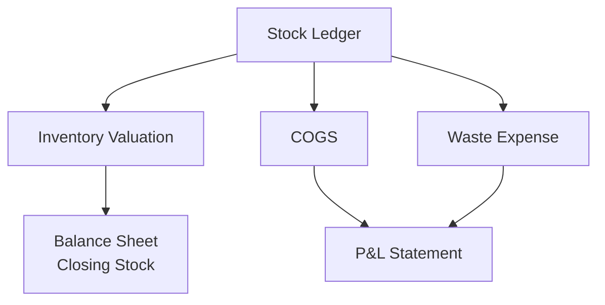
